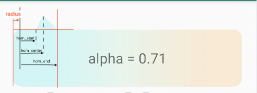

# PapawView
[](https://jitpack.io/#jiarWang/PapawView)

`PapawView`: 自带羊角背景的`View`

使用：<p/>
Step 1. Add it in your root `./build.gradle` at the end of repositories:
```gradle
	allprojects {
		repositories {
			...
			maven { url 'https://jitpack.io' }
		}
	}
```
Step 2. Add the dependency
```gradle
	dependencies {
	        implementation 'com.github.jiarWang:PapawView:1.0.0'
	}
```
## PapawTextView
<hr/>

`PapawTextView`继承自`TextView`；通过使用`PapawTextView`的额外属性，可以使


| 属性        |      类型 |                                 说明                                  |
| ----------- | --------: | :-------------------------------------------------------------------: |
| radius      | dimension |                          四个边角的圆弧半径                           |
| horn_side   |      enum | ^ 羊角所在边的位置 (top &brvbar; right &brvbar; bottom &brvbar; left) |
| color       |     color |                               背景颜色                                |
| horn_alpha  |     float |                              背景透明度                               |
| horn_height | dimension |                               ^羊角高度                            |
| horn_start  | dimension |                羊角起始点距离所在边的起始点的相对距离                 |
| horn_center | dimension |                 羊角中点距离所在边的起始点的相对距离                  |
| horn_end    | dimension |                羊角结束点距离所在边的起始点的相对距离                 |
<hr/>


>提示：
>
>  羊角所在的边的`padding`需要比对边的`padding`值大一个羊角高度，即使对边没有`padding`，例如：
> >
> 羊角所在边为`top`,则需要满足：`paddingTop - paddingBottom = horn_height`，即使`paddingBottom = 0`

<hr/>

## PapawLayout

`PapawLayout`继承自`CoordinatorLayout`,这样便可以在`Papaw`图形上做更多的事情。
`PapawLayout`的额外属性的使用同`PapawTextView`一样。

## PapawHelper
<hr/>

如果`PapawLayout`和`PapawTextView`不能满足你的需求，可是只是使用`PapawHelper`来直接帮助你完成这种带羊角背景的自定义`View`(或`ViewGroup`);
### PapawHelper 说明
* setPaint(Paint paint) ： 设置绘制背景的画笔
* setAlpha(float alpha) ：设置背景的透明度(0~1)
* setHornHeight(float hornHeight)  : 设置羊角高度
* setRadius(float radius) ： 设置矩形边角半径 
* setHornPoint(@Side int hornSide, float start, float center, float end) ： 设置羊角所在边、羊角起始位置、中间点位置、结束位置。
### PapawHelper例子
<hr/>

使用`PapawHelper`让自定义`View`带上羊角，只需要两行代码:

1) 为自定义的`View`添加一个`PapawHelper`类型成员变量`mPapawHelper`;
2) 重写`onDraw`方法，并在`super.onDraw(canvas)`前，调用`mPapawHelper.drawBackground(canvas);`
```java
//CustomView.java
    private PapawHelper mPapawHelper = new PapawHelper(this)
                                        . setHornHeight(5)//设置羊角高度
                                        .setHornPoint(PapawHelper.TOP, 5, 15, 20);
        ....

    @Override
    public void onDraw(Canvas canvas) {
        mPapawHelper.drawBackground(canvas);
        super.onDraw(canvas);
    }
```
### PapawHelper高级用法

> * 同样可以通过继承`PapawHelper`来为你的`PapawView`添加更多功能。
> * `lineHorn(final Path path, @Side int side, PointF startPoint, PointF endPoint)`里可以重定义自己的羊角画法
> * `onDrawPath(Canvas canvas, Paint paint, Path path)`里可以重新定义背景的绘制

# License
<hr/>

```
Copyright 2014 wangjian

Licensed under the Apache License, Version 2.0 (the "License");
you may not use this file except in compliance with the License.
You may obtain a copy of the License at

   http://www.apache.org/licenses/LICENSE-2.0

Unless required by applicable law or agreed to in writing, software
distributed under the License is distributed on an "AS IS" BASIS,
WITHOUT WARRANTIES OR CONDITIONS OF ANY KIND, either express or implied.
See the License for the specific language governing permissions and
limitations under the License.
```